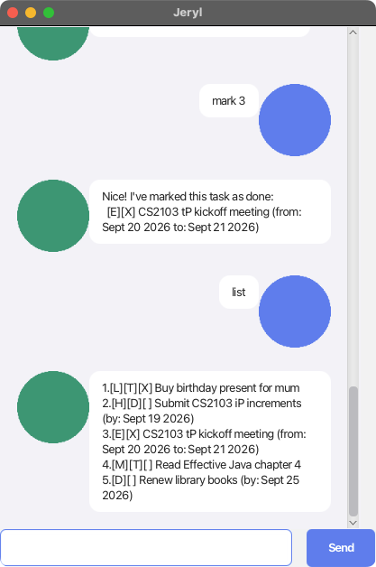

# Jeryl User Guide

Jeryl is a **desktop chatbot for tracking your todos, deadlines, and events**, controlled entirely by typing short commands into a chat window. If you can type fast, Jeryl can manage your tasks faster than any mouse-driven to-do app.



## Quick start

1. Ensure you have **Java 25** installed on your computer.
2. Download the latest `.jar` release of Jeryl.
3. Open a terminal in the folder containing the jar and run:
   ```
   java -jar jeryl.jar
   ```
4. Type a command into the text box at the bottom and press Enter (or click **Send**). Try `list` to get started!

Your tasks are automatically saved to disk after every change, so you can close and reopen Jeryl without losing anything.

## Features

> **Notes on the command format**
> - Words in `UPPER_CASE` are parameters you supply, e.g. in `todo DESCRIPTION`, `DESCRIPTION` is a parameter, as in `todo read book`.
> - Dates must be in `yyyy-mm-dd` format, e.g. `2019-10-15`.
> - `/priority LEVEL` is optional on `todo`, `deadline`, and `event`, where `LEVEL` is one of `high`, `medium`, or `low`.

### Listing all tasks: `list`

Shows every task currently tracked, numbered in the order they were added.

Example: `list`

### Adding a todo: `todo`

Adds a simple task with no date attached.

Format: `todo DESCRIPTION [/priority LEVEL]`

Examples:
```
todo read book
todo read book /priority high
```

### Adding a deadline: `deadline`

Adds a task that needs to be done by a specific date.

Format: `deadline DESCRIPTION /by DATE [/priority LEVEL]`

Example:
```
deadline submit report /by 2026-09-20 /priority medium
```

### Adding an event: `event`

Adds a task spanning a start and end date. The end date must be after the start date.

Format: `event DESCRIPTION /from START_DATE /to END_DATE [/priority LEVEL]`

Example:
```
event team offsite /from 2026-10-01 /to 2026-10-03
```

### Marking a task as done: `mark`

Marks the task at the given number (as shown by `list`) as done.

Format: `mark INDEX`

Example: `mark 2`

### Marking a task as not done: `unmark`

Reverts a task back to not-done.

Format: `unmark INDEX`

Example: `unmark 2`

### Deleting a task: `delete`

Removes the task at the given number.

Format: `delete INDEX`

Example: `delete 3`

### Finding tasks: `find`

Shows all tasks whose description contains the given keyword (case-insensitive).

Format: `find KEYWORD`

Example: `find book`

### Exiting the app: `bye`

Says goodbye and closes the window.

Example: `bye`

## Errors

If a command is malformed — an unknown command word, a missing or invalid date, a task number that doesn't exist, and so on — Jeryl shows an explanatory `OOPS!!!` message instead of crashing, and your task list is left unchanged. Just fix the command and try again.

## Saving the data

Jeryl saves all your tasks automatically to `data/jeryl.txt` after every change — there's no save command, and no need to manually save before exiting.
